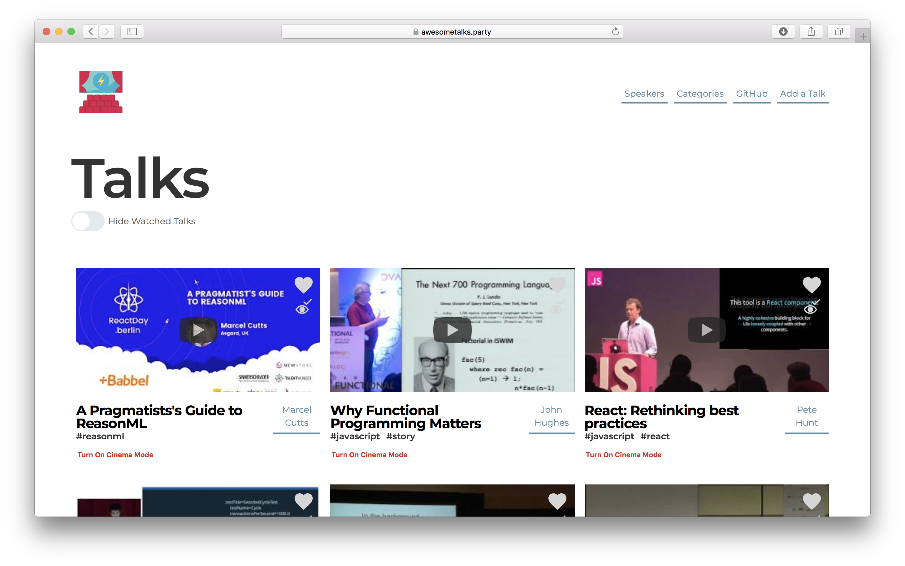

# Awesome Talks

[](#contributors) ======= [](#contributors) [](https://travis-ci.org/SaraVieira/awesome-talks) [](https://github.com/styled-components/styled-components) [](https://github.com/prettier/prettier)

<a href="https://saravieira-awesome-talks.now.sh/">Staging</a>

<center>
    
    <a href="https://awesometalks.party">https://awesometalks.party</a>
</center>

## What ?

Awesome Tech Talks Curated by the Community

## How to Run it ?

First you need node and git installed after that run:

_npm_

```sh
git clone https://github.com/SaraVieira/awesome-talks
cd awesome-talks
npm i
npm run dev
```

_yarn_

```sh
git clone https://github.com/SaraVieira/awesome-talks
cd awesome-talks
yarn
yarn dev
```

if you have any problems let me know and we can solve this !

## I want to add a talk

There is a form on the page where you can add talk and it will be sent to the CMS so I can add the rest of the info. If you want to help me curate the talks or improve the form please let me know :)

## What did you use to make this?

The website was made with React, Styled Components, React-Apollo and the backend is hosted on GraphCMS

## Anything else I should add please let me know

## Contributors

<!-- ALL-CONTRIBUTORS-LIST:START - Do not remove or modify this section -->

<!-- prettier-ignore -->
| [<br /><sub><b>Hosmel Quintana</b></sub>](http://hosmelq.com)<br />[🐛](https://github.com/SaraVieira/awesome-talks/issues?q=author%3Ahosmelq "Bug reports") | [<br /><sub><b>Cain Hall</b></sub>](http://cainhall.com.au)<br />[💻](https://github.com/SaraVieira/awesome-talks/commits?author=cain "Code") | [<br /><sub><b>Glenn Reyes</b></sub>](https://twitter.com/glnnrys)<br />[🐛](https://github.com/SaraVieira/awesome-talks/issues?q=author%3Aglennreyes "Bug reports") | [<br /><sub><b>Pavithra Kodmad</b></sub>](http://pavithrakodmad.com)<br />[🐛](https://github.com/SaraVieira/awesome-talks/issues?q=author%3Apksjce "Bug reports") | [<br /><sub><b>James</b></sub>](https://jmes.tech)<br />[📦](#platform-varjmes "Packaging/porting to new platform") | [<br /><sub><b>Sara Vieira</b></sub>](http://iamsaravieira.com)<br />[💻](https://github.com/SaraVieira/awesome-talks/commits?author=SaraVieira "Code") [🤔](#ideas-SaraVieira "Ideas, Planning, & Feedback") [🎨](#design-SaraVieira "Design") [📖](https://github.com/SaraVieira/awesome-talks/commits?author=SaraVieira "Documentation") | [<br /><sub><b>Farzad YZ</b></sub>](http://farzadyz.com)<br />[💻](https://github.com/SaraVieira/awesome-talks/commits?author=farskid "Code") [🐛](https://github.com/SaraVieira/awesome-talks/issues?q=author%3Afarskid "Bug reports") [🤔](#ideas-farskid "Ideas, Planning, & Feedback") |
| :---: | :---: | :---: | :---: | :---: | :---: | :---: |
| [<br /><sub><b>tsiq-swyx</b></sub>](https://github.com/tsiq-swyx)<br />[💬](#question-tsiq-swyx "Answering Questions") [🤔](#ideas-tsiq-swyx "Ideas, Planning, & Feedback") [👀](#review-tsiq-swyx "Reviewed Pull Requests") | [<br /><sub><b>Siddharth Kshetrapal</b></sub>](https://siddharthkp.github.io)<br />[💻](https://github.com/SaraVieira/awesome-talks/commits?author=siddharthkp "Code") | [<br /><sub><b>Shriram Balaji</b></sub>](https://shriram-balaji.github.io)<br />[💻](https://github.com/SaraVieira/awesome-talks/commits?author=Shriram-Balaji "Code") | [<br /><sub><b>Vijay Singh</b></sub>](http://sudovijay.com)<br />[💬](#question-sudovijay "Answering Questions") [💻](https://github.com/SaraVieira/awesome-talks/commits?author=sudovijay "Code") [🤔](#ideas-sudovijay "Ideas, Planning, & Feedback") | [<br /><sub><b>Scott O'Hara</b></sub>](https://scottohara.me)<br />[💻](https://github.com/SaraVieira/awesome-talks/commits?author=scottaohara "Code") | [<br /><sub><b>Cristian Botella</b></sub>](https://github.com/cbh6)<br />[💻](https://github.com/SaraVieira/awesome-talks/commits?author=cbh6 "Code") | [<br /><sub><b>Vitalii Sashyn</b></sub>](https://github.com/vsashyn)<br />[💻](https://github.com/SaraVieira/awesome-talks/commits?author=vsashyn "Code") [🎨](#design-vsashyn "Design") |
| [<br /><sub><b>Vladimir Milojevic</b></sub>](https://github.com/vladamx)<br />[🐛](https://github.com/SaraVieira/awesome-talks/issues?q=author%3Avladamx "Bug reports") [💻](https://github.com/SaraVieira/awesome-talks/commits?author=vladamx "Code") | [<br /><sub><b>Piotr Balbier</b></sub>](https://github.com/phoulgaux)<br />[🐛](https://github.com/SaraVieira/awesome-talks/issues?q=author%3Aphoulgaux "Bug reports") [💻](https://github.com/SaraVieira/awesome-talks/commits?author=phoulgaux "Code") | [<br /><sub><b>Meghashyam Kodmad</b></sub>](https://github.com/shyamks)<br />[💻](https://github.com/SaraVieira/awesome-talks/commits?author=shyamks "Code") |

<!-- ALL-CONTRIBUTORS-LIST:END -->

Thanks goes to these wonderful people ([emoji key](https://github.com/kentcdodds/all-contributors#emoji-key)):

<!-- ALL-CONTRIBUTORS-LIST:START - Do not remove or modify this section -->

<!-- prettier-ignore -->
<!-- ALL-CONTRIBUTORS-LIST:END -->

This project follows the [all-contributors](https://github.com/kentcdodds/all-contributors) specification. Contributions of any kind welcome!
